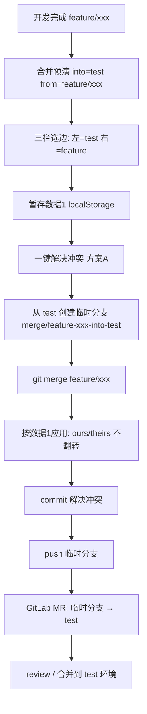

# 合并预演 → 一键解决冲突 → MR（业务场景）

> 约定：**待合并分支** = `feature/xxx`，**目标分支** = `test`（如 test 环境）。  
> 预演语义：把 `from`（待合并）合进 `into`（目标）。  
> 一键落盘采用 **方案 A**（临时分支从目标拉出，再 merge 待合并），与预演左右语义一致。

---

## 1. 业务目标

开发完成 `feature/xxx` 后，需要合入 `test` 做环境验证。若有冲突：

1. 先在工具里做**合并预演**（不改工作区），选边并**暂存**（数据 1）。
2. 再**一键解决冲突**：在本地按暂存生成可推送的临时分支与 commit。
3. 推远程后，在 GitLab 提 **MR：临时分支 → test**。

原则：预演怎么选，落盘就怎么选；不翻转 ours/theirs。

---

## 2. 预演与暂存（数据 1）

### 2.1 分支角色

| 角色 | 变量 | 示例 | 三栏 UI |
|------|------|------|---------|
| 目标分支 | `into` | `test` | **左** Changes from test（ours） |
| 待合并分支 | `from` | `feature/xxx` | **右** Changes from feature（theirs） |

对应 git 预演：`merge-tree` / 合并预演 =「把 `from` 合进 `into`」。

### 2.2 暂存结构（localStorage）

键：`git-insight:merge-resolve:v1:{cwd}\0{into}\0{from}`

```ts
{
  cwd: string;
  into: "test";           // 目标
  from: "feature/xxx";    // 待合并
  updatedAt: number;
  files: {
    [path: string]: {
      path: string;
      choices: { [hunkId: string]: "ours" | "theirs" | "base" };
      resolvedContent: string;  // 按预演选择拼好的完整文件
      updatedAt: number;
    };
  };
}
```

| 选择 | 含义 |
|------|------|
| `ours` / Accept Left | 采用**目标**侧（test） |
| `theirs` / Accept Right | 采用**待合并**侧（feature/xxx） |
| `resolvedContent` | 该文件最终应写成的全文（预演视角） |

---

## 3. 为何不用「从 feature 拉临时分支再 merge test」

若流程为：

```text
feature/xxx → 临时分支 feature/xxx_test
在临时分支上：git merge test
```

则 merge 时：

| 时刻 | ours | theirs |
|------|------|--------|
| 预演 | test（左） | feature（右） |
| 临时分支 merge test | feature（当前） | test（进来） |

**左右对调。** 暂存里的 `ours`/`theirs` 不能原样套用，必须翻转或只写 `resolvedContent`，易错。

因此一键解决采用下面的 **方案 A**。

---

## 4. 方案 A：推荐的一键解决流程（与预演同向）

```text
预演：from=feature/xxx  →  into=test
落盘：在「基于 test 的临时分支」上 merge feature/xxx
MR  ：临时分支 → test
```

### 4.1 步骤

| 步骤 | 动作 | 说明 |
|------|------|------|
| 1 | 确认暂存数据 1 | `into=test`，`from=feature/xxx`，冲突已选完（或允许部分 + 策略） |
| 2 | 更新引用 | 按需 `fetch`；解析 `test`、`feature/xxx` 的 tip |
| 3 | 创建临时分支 | 从**目标**出发，例如：`merge/feature-xxx-into-test` 或 `feature/xxx_test`（命名见下） |
| 4 | 检出临时分支 | 当前分支内容 = test |
| 5 | `git merge feature/xxx` | 与预演同向；冲突时 ours=test、theirs=feature |
| 6 | 按暂存应用 | `choices.ours`→取当前 ours；`theirs`→取 theirs；或直接写入 `resolvedContent` |
| 7 | `git add` + `commit` | 生成「解决冲突」的 commit |
| 8 | `git push -u origin <临时分支>` | 推到远程 |
| 9 | 创建 MR | GitLab：`临时分支` → `test`（目标） |

### 4.2 临时分支命名建议

任选一种，团队统一即可：

- `merge/<from-slug>-into-<into>` → `merge/feature-xxx-into-test`
- `feature/xxx_test`（短；注意与「从 feature 拉出」的旧设想同名不同义，文档/UI 需写明「基于 test」）

推荐 **`merge/feature-xxx-into-test`**，一眼看出方向：into = test。

### 4.3 应用暂存时的映射（方案 A，无需翻转）

在临时分支上执行 `git merge feature/xxx` 出现冲突后：

| 暂存选择 | git 工作区 / 标记 |
|----------|-------------------|
| `ours` | 保留 **ours**（test） |
| `theirs` | 采用 **theirs**（feature/xxx） |
| 有 `resolvedContent` | 可直接覆盖该路径为最终全文，再 `git add` |

与预演左/右一致。

---

## 5. 端到端串联



### 角色对照（全程）

```text
预演 UI 左  = into = test     = merge 时 ours
预演 UI 右  = from = feature  = merge 时 theirs
MR 源分支   = 临时分支（基于 test，已 merge 并解决冲突）
MR 目标分支 = test
```

---

## 6. 实现状态（当前）

| 能力 | 状态 | 说明 |
|------|------|------|
| 合并预演 | 已有 | `merge-tree`，不改工作区 |
| 暂存数据 1 | 已有 | webview `localStorage` |
| 一键步骤 1–3 + push | **已实现** | UI「一键解决并推送」→ 宿主确认 → `applyStashedResolve` |
| 自动创建 MR | **未自动提交** | 只生成「新建 MR/PR」浏览器链接并可选打开 |

### 6.1 一键解决做了什么

1. 校验工作区干净  
2. `checkout -B merge/<from>-into-<into> <intoSha>`  
3. `merge --no-ff --no-commit <fromSha>`  
4. 用暂存 `resolvedContent` 覆盖冲突文件并 `git add`（缺暂存的冲突文件则 abort）  
5. `git commit`  
6. `git push -u origin HEAD:refs/heads/<临时分支>`  
7. 根据 `origin` URL 生成创建 MR/PR 链接，弹窗询问是否打开  

### 6.2 MR 怎么做（当前策略与后续选项）

**当前（推荐先落地）：** 不调 GitLab/GitHub API，只打开创建页：

- GitLab：`/-/merge_requests/new?merge_request[source_branch]=…&merge_request[target_branch]=…`
- GitHub：`/compare/<target>...<source>?expand=1`

用户在网页上改标题/描述/Reviewer 后提交，权限与 2FA 都走浏览器登录，扩展无需存 Token。

**后续可选（按需）：**

| 方式 | 优点 | 缺点 |
|------|------|------|
| 打开创建页（现状） | 无密钥、实现简单 | 多点一次「创建」 |
| `glab mr create` / `gh pr create` | CLI 一键 | 依赖本机已登录 CLI |
| GitLab/GitHub API + Token | 全自动 | 要管 Token、权限、企业网关 |

建议：默认保持「打开创建页」；若团队统一装了 `glab`/`gh`，再加可选「用 CLI 创建」。

---

## 7. 风险与注意点

1. **into/from 不能填反**：UI 必须固定「目标 = into = 左」「待合并 = from = 右」。
2. **临时分支必须基于 into**：若误从 feature 拉出再 `merge test`，又回到翻转问题。
3. **两端 tip 变化**：暂存后若 `test` / `feature` 有新提交，一键前应重新预演。
4. **工作区必须干净**：否则拒绝执行，避免和本地未提交改动搅在一起。
5. **冲突文件必须全部有暂存**：缺文件会 `merge --abort` 并报错。
6. **执行后停留在临时分支**：便于核对；需要时自行切回原分支。
7. **远程已有同名分支**：`checkout -B` / push 可能覆盖远端历史，推送前留意命名。

---

## 8. 结论

- 业务：`feature/xxx` → `test`，有冲突则预演选边 → 暂存 → 一键落盘 → 打开 MR 创建页。
- **采用方案 A**：临时分支从 **test** 创建，再 `merge feature/xxx`，暂存直接可用。
- MR：**先打开创建链接**，不自动 API 建单；后续再按需接 `glab`/`gh`。

---

## 9. 相关代码

| 说明 | 路径 |
|------|------|
| 一键落盘 + push + MR 链接 | [`packages/core/src/merge/applyResolve.ts`](../packages/core/src/merge/applyResolve.ts) |
| 暂存读写 | [`packages/extension/webview/src/conflict/resolveStore.ts`](../packages/extension/webview/src/conflict/resolveStore.ts) |
| 三栏解决 UI / 一键按钮 | [`packages/extension/webview/src/ConflictResolvePanel.vue`](../packages/extension/webview/src/ConflictResolvePanel.vue) |
| 宿主确认与打开 MR | [`packages/extension/src/GitInsightPanel.ts`](../packages/extension/src/GitInsightPanel.ts) |
| 请求路由 | [`packages/extension/src/coreBridge.ts`](../packages/extension/src/coreBridge.ts) |
| 预演 merge-tree | [`packages/core/src/merge/preview.ts`](../packages/core/src/merge/preview.ts) |

---

*文档随「一键解决冲突」实现同步更新。*
