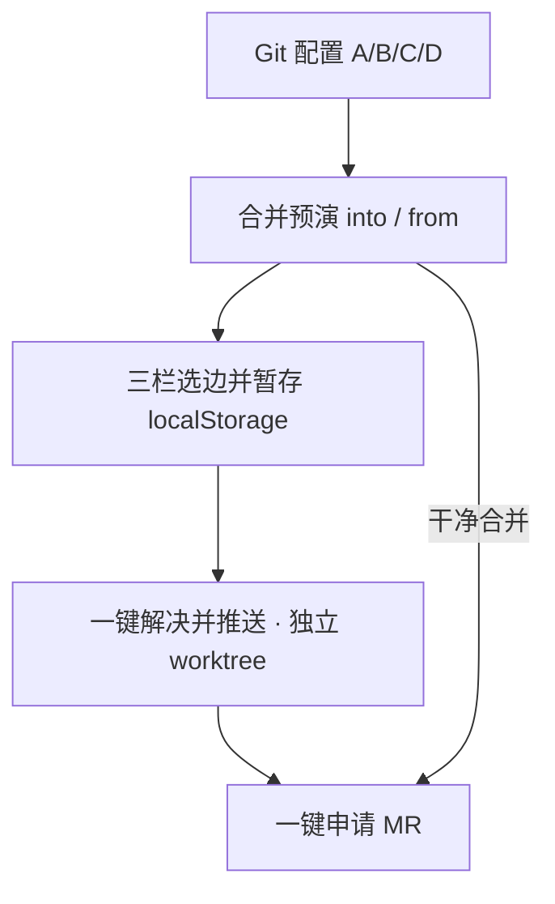

# Git Insight · 项目整体设计

本文是仓库**唯一**的整体设计文档（Skill 说明见 [`skills/git-branch-insight/SKILL.md`](../skills/git-branch-insight/SKILL.md)）。

覆盖：包结构、业务流、各模块职责，以及**实现中实际调用的 git / gh / glab 指令**。

---

## 1. 目标与边界

| 能力 | 交付面 | 是否改工作区 |
|------|--------|--------------|
| 分支图 / 合并预演 | CLI Skill + 扩展 Webview | **否**（`merge-tree` 等） |
| 冲突选边暂存 | 扩展 Webview（localStorage） | 否 |
| 一键解决并推送 | 扩展 → core `applyStashedResolve` | **是**（独立 **worktree**，主工作区不 checkout） |
| 一键申请 MR/PR | 扩展 → core `createMergeRequest` | 否（调 gh/glab/API 或开浏览器） |

约定：

- **目标分支** = `into` = 预演 UI **左** = merge 时 **ours**
- **待合并分支** = `from` = 预演 UI **右** = merge 时 **theirs**
- 一键落盘必须与预演同向：临时分支**基于 into**，再 `merge from`（避免 ours/theirs 翻转）

---

## 2. 仓库结构

```text
packages/core                 @git-insight/core   — 唯一 Git/MR 引擎 + CLI
packages/extension            git-insight         — Cursor/VS Code 宿主
packages/extension/webview    @git-insight/webview — Vue3 UI（G6 分支图）
skills/git-branch-insight     Agent Skill（只读 CLI）
docs/project-design.md        本文
```

| 包 | 职责 |
|----|------|
| **core** | `runGit` / fetch / 分支图 / merge-tree 预演 / worktree 落盘 / gh·glab·Token 建 MR |
| **extension** | Webview 桥接、确认对话框、globalState 配置、CLI 下载、终端 `auth login` |
| **webview** | 分支树、G6 图、冲突三栏、Git 配置、MR 对话框；不直接 spawn git |

前置：系统 Git **≥ 2.38**（需要新版 `merge-tree --write-tree`）。

---

## 3. 端到端业务流



有冲突时：须先「一键解决并推送」成功，才可申请 MR。干净合并可直接申请（源分支多为已推送的 feature）。

---

## 4. 模块设计与指令表

下列指令为代码中**真实 argv**（经 `spawn("git"|"gh"|"glab", …)` 或集成终端 `sendText`）。

### 4.1 公共 Git 基础设施

| 用途 | 指令 | 代码 |
|------|------|------|
| 版本 | `git --version` | `git/version.ts` |
| 仓库根 | `git rev-parse --show-toplevel` | `git/runner.ts` |
| 解析 tip | `git rev-parse --verify <rev>^{commit}` | 多处 |
| 共同祖先 | `git merge-base <a> <b>` | graph / merge |
| 远程 URL | `git remote get-url <remote>` | 平台探测 / MR URL |
| 当前分支 | `git branch --show-current` | applyResolve |

底层：`packages/core/src/git/runner.ts`（`GIT_TERMINAL_PROMPT=0`）。

---

### 4.2 Fetch

| 用途 | 指令 | 代码 |
|------|------|------|
| 刷新远端 | `git fetch --prune --progress <remote>` | `git/fetch.ts` |

CLI：`git-insight fetch [--remote origin]`  
扩展 / CLI 的 `graph`、`preview-merge`：**默认 fetch**（`--no-fetch` 可关）。

---

### 4.3 分支图

| 用途 | 指令 | 代码 |
|------|------|------|
| 枚举分支 tip | `git for-each-ref --format=%(refname)%00%(refname:short)%00%(objectname)%00%(upstream:short) refs/heads refs/remotes` | `graph/builder.ts`、`coreBridge` 下拉 |
| 提交 DAG | `git rev-list --parents [--max-count=N] <tips…>` | `graph/builder.ts` |
| 双分支裁剪 | `git rev-list --parents <into> <from> ^<base>^@` | 同上 |
| 提交元数据 | `git show -s --format=%H%00%P%00%an%00%at%00%s <sha…>` | 同上（分块） |
| 领先计数 | `git rev-list --count <base>..<tip>` | lineage |
| 分叉点 | `git rev-list --reverse --max-count=1 <base>..<from>` | branchedFrom |

UI：仅展示**分支 tip**（本地绿 / 远程蓝）；边为 tip 间最近祖先关系。可视化：**AntV G6**（`webview/src/graph/toG6Data.ts`）。

CLI：`git-insight graph [--into] [--from] [--max] [--no-fetch]`

---

### 4.4 合并预演（只读）

| 用途 | 指令 | 代码 |
|------|------|------|
| 预演合并树 | `git merge-tree --write-tree -z --messages --name-only [--allow-unrelated-histories] <intoSha> <fromSha>` | `merge/preview.ts` |
| 旧版 fallback | `git merge-tree <base> <intoSha> <fromSha>` | 同上 |
| 读一侧文件 | `git show <rev>:<path>` | `merge/conflictContent.ts` |
| 合成冲突标记 | `git merge-file -p --diff3 -L ours:… -L base -L theirs:…` | 同上 |
| 路径是否存在 | `git cat-file -e <rev>:<path>` | blame |
| 差异范围 | `git diff -U0 <base>...<tip> -- <path>` | blame |
| 行级溯源 | `git blame -l -w -L<start>,<end> --line-porcelain <rev> -- <path>` | blame |
| （可选）关联 PR | `gh pr list --search <sha7> --state all --json number --limit 1` | blame，失败静默 |

入口：`rehearseMerge` → CLI `preview-merge` / `conflict-blame`；扩展 Tab「合并预演」。

空 tree 常量：`4b825dc642cb6eb9a060e54bf8d0927f6fb5fb496`（不现场 `hash-object`）。

---

### 4.5 冲突暂存（无 git 指令）

| 项 | 说明 |
|----|------|
| 存储 | Webview `localStorage` |
| 键 | `git-insight:merge-resolve:v1:{cwd}\0{into}\0{from}` |
| 内容 | 各冲突文件的 `choices`（ours/theirs/base）与拼好的 `resolvedContent` |
| 代码 | `webview/src/conflict/resolveStore.ts`、`ConflictResolvePanel.vue` |

---

### 4.6 一键解决并推送（独立 worktree）

主工作区 **不** `checkout` 临时分支；在临时目录 worktree 内完成 merge / add / commit / push，最后 `worktree remove`。

| 步骤 | 指令 | 代码 |
|------|------|------|
| 建 worktree + 临时分支 | `git worktree add -B <tempBranch> <wtPath> <intoSha>` | `merge/applyResolve.ts` |
| 同向 merge（停在冲突） | `git merge --no-ff --no-commit <fromSha>` | 同上 |
| 列出未合并 | `git diff --name-only --diff-filter=U` | 同上 |
| 写入暂存正文 | （写文件）+ `git add -- <path>` | 同上 |
| 提交 | `git commit -m <msg>` | 同上 |
| 读 SHA | `git rev-parse HEAD` | 同上 |
| 推送 | `git push -u <remote> HEAD:refs/heads/<tempBranch>` | 同上 |
| 失败回滚 | `git merge --abort` | 同上 |
| 清理 | `git worktree remove --force <wtPath>` + `git worktree prune` | finally |

默认临时分支名：`merge/<from-slug>-into-<into>`。  
MR 浏览器链接会用到：`git remote get-url <remote>`。

扩展：宿主模态确认 → `applyResolve` 协议。

---

### 4.7 打开远程仓库（扩展）

| 用途 | 指令 | 代码 |
|------|------|------|
| 克隆 | `git clone -- <url> <dir>` | `remoteRepo.ts` |
| 已有缓存更新 | `git fetch --all --prune` | 同上 |

---

### 4.8 Git / MR 配置（扩展）

配置持久化在扩展 **`globalState`**（各仓库共用）。旧版项目内 `.git-insight/config.local.json` 会迁移一次。

| 方式 | 就绪条件 | 相关指令 / 行为 |
|------|----------|-----------------|
| **A** 本机 CLI | PATH 中 `gh`/`glab` 已安装且 `auth status` 成功 | `gh\|glab --version`；`gh\|glab auth status`；终端 `gh\|glab auth login` |
| **B** 下载 CLI | 扩展 globalStorage 内二进制已下载且已登录 | 同上，可执行文件为扩展目录路径；PowerShell 需 `& "path" auth login` |
| **C** Token | 面板填写并保存 GitHub/GitLab Token | 无 CLI；走 REST API |
| **D** 浏览器 | 始终可用 | 只打开预填创建页 URL |

检测与下载：`packages/extension/src/cliBundle.ts`  
登录唤起：`GitInsightPanel` → 集成终端 `sendText`  
UI：`GitConfigPanel.vue`

解压下载包时可能调用（非 git）：Windows `Expand-Archive`；Unix `unzip` / `tar`。

---

### 4.9 准备 / 创建 MR（gh · glab · Token · 浏览器）

公共 git：

| 用途 | 指令 |
|------|------|
| 远程 URL | `git remote get-url <remote>` |
| 分支是否存在 | `git show-ref --verify --quiet refs/heads/<name>` |
| 远程分支 | `git show-ref --verify --quiet refs/remotes/<remote>/<name>` |

**GitHub · gh**

| 用途 | 指令 |
|------|------|
| 版本 / 登录 | `gh --version`；`gh auth status` |
| 协作者候选 | `gh api repos/<owner>/<repo>/collaborators?per_page=100 --jq '…'` |
| fallback | `gh api repos/…/assignable_users?per_page=100 --jq '…'` |
| 建 PR | `gh pr create --base <tgt> --head <src> --title … --body … [--reviewer a,b]` |

**GitLab · glab**

| 用途 | 指令 |
|------|------|
| 版本 / 登录 | `glab --version`；`glab auth status` |
| 成员候选 | `glab api projects/<encoded>/members/all?per_page=100` |
| 建 MR | `glab mr create --source-branch … --target-branch … --title … --description … --yes [--reviewer x]…` |

**Token（方式 C）**：GitHub REST `collaborators` / `pulls`；GitLab `members/all` + `merge_requests`（HTTP，非 CLI）。

**浏览器（方式 D）**：根据 `remote get-url` 拼创建页并 `openExternal`。

代码：`packages/core/src/merge/createMr.ts`；UI：`CreateMrDialog.vue`。

---

## 5. CLI 表面（Skill / 脚本）

```text
git-insight graph [--cwd] [--max] [--into] [--from] [--no-fetch]
git-insight fetch [--cwd] [--remote]
git-insight preview-merge --into <目标> --from <待合并> [--cwd] [--no-fetch]
git-insight conflict-blame …   # 同 preview-merge
```

**不包含**一键 resolve / create MR（仅扩展调用库函数）。

构建与调用：

```bash
pnpm --filter @git-insight/core build
pnpm --filter @git-insight/core exec node dist/cli.js graph
```

---

## 6. 扩展 UI 模块对照

| Tab / 面板 | 功能 | 主要协议 / 入口 |
|------------|------|-----------------|
| Git 配置 | A–D、Token、下载 CLI、登录 | `getGitConfig` / `saveGitConfig` / `downloadCli` / `cliAuthLogin` |
| 分支图 | tip 图 + 路径报告 | `graph` → `buildBranchGraph` |
| 合并预演 | 冲突三栏、暂存、一键解决、申请 MR | `preview` / `applyResolve` / `prepareCreateMr` / `createMr` |

可视化：G6（非 X6）；数据转换 `webview/src/graph/toG6Data.ts`。

---

## 7. 风险与约定

1. **into / from 不可填反**（左右与 ours/theirs 绑定）。
2. 临时分支必须基于 **into**；误从 feature 拉出再 merge 目标会左右对调。
3. tip 变化后应重新预演再一键解决。
4. 主工作区可有未提交改动（worktree 隔离）；若临时分支名已在主仓检出则拒绝。
5. 冲突文件须全部有暂存，否则 worktree 内 `merge --abort`。
6. PowerShell 执行扩展内 CLI：`& "…\gh.exe" auth login`（不可省略 `&`）。

---

## 8. 关键代码索引

| 模块 | 路径 |
|------|------|
| Git 运行器 | `packages/core/src/git/runner.ts` |
| Fetch | `packages/core/src/git/fetch.ts` |
| 分支图 | `packages/core/src/graph/builder.ts` |
| 合并预演 | `packages/core/src/merge/preview.ts` / `rehearsal.ts` |
| 一键落盘 | `packages/core/src/merge/applyResolve.ts` |
| 创建 MR | `packages/core/src/merge/createMr.ts` |
| CLI | `packages/core/src/cli.ts` |
| 宿主桥接 | `packages/extension/src/coreBridge.ts` |
| CLI 下载/登录检测 | `packages/extension/src/cliBundle.ts` |
| 配置存储 | `packages/extension/src/gitConfigStore.ts` |
| 冲突 UI | `packages/extension/webview/src/ConflictResolvePanel.vue` |
| Skill | `skills/git-branch-insight/SKILL.md` |

---

*文档与当前实现同步；旧分散文档（git-commands / merge-resolve-workflow / graph-engine / plan）已合并至此。*
