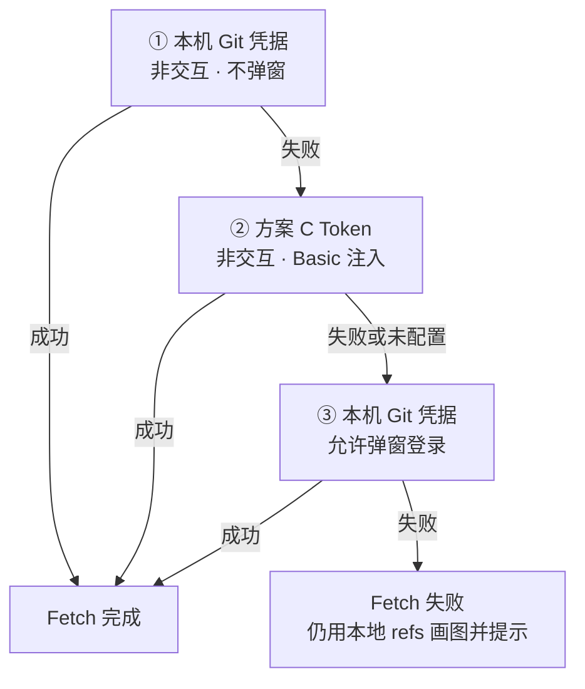

# Git Insight · 使用说明

面向在 Cursor / VS Code 中安装扩展后的日常操作。设计细节与指令全表见 [project-design.md](./project-design.md)。

---

## 1. 安装与打开

```bash
# 仓库根目录
pnpm package:vsix
cursor --install-extension git-insight.vsix --force
```

安装后 **Reload Window**，命令面板执行：

- `Git Insight: Open Web Visualization` — 打开面板（默认进入 **Git 配置**）
- `Git Insight: 合并预演` — 打开并切到合并预演

在面板顶部输入本机仓库路径或 GitHub `owner/repo`，点「打开」。

> 浏览器 `pnpm preview` 为预览模式，**不能**写仓库 / 推送 / 申请 MR，仅便于看 UI。

---

## 2. 推荐使用顺序

```text
① Git 配置（选 A/B/C/D）
② 分支图（会先 fetch，与线上对齐）
③ 合并预演（选「线上目标」+「我的分支」→ 冲突选边 → 暂存）
④ 一键解决并推送（有冲突时）
⑤ 一键申请 MR
```

| 场景 | 能否直接申请 MR |
|------|----------------|
| 预演有冲突 | 须先「一键解决并推送」成功 |
| 预演可干净合并 | 可直接申请（源一般为已推送的我的分支） |

---

## 3. Git / MR 配置（Tab：Git 配置）

四种方式**四选一**（切换即自动保存到扩展全局配置）：

| 方式 | 说明 | 何时用 |
|------|------|--------|
| **A** 本机 gh / glab | PATH 中已安装并登录的 CLI | 本机已有 CLI（推荐） |
| **B** 下载 CLI 到扩展目录 | 下载到扩展存储，不占系统 PATH | 不想装系统 CLI |
| **C** Token（API） | 填写 GitHub / GitLab PAT | 无 CLI、或仅用 Token |
| **D** 仅打开浏览器创建页 | 不自动建单，打开预填 MR/PR 页 | 临时 / 无自动化需求 |

### 3.1 首次默认选中

- 本机已装对应 `gh` / `glab` → 默认 **A**
- 否则 → 默认 **D**
- 仅当从未保存过 `mrMethod` 时自动写入

### 3.2 方案 C（Token）使用要点

1. **按远程平台只填一侧**  
   - 远程倾向 `github` → 只可填 GitHub Token，GitLab 输入框禁用  
   - 远程倾向 `gitlab` → 只可填 GitLab Token（**必须以 `glpat-` 开头**）
2. **校验时机**：Token 内容变更并确认后（HTML `change`，非逐键），自动校验并保存  
3. **标题旁状态**：有效 / 无效 / 格式错误，以及有效期（**中国时间** `年/月/日 时:分:秒`）  
4. **进页预校验**：已有 Token 时进入配置会自动校验一次  
5. **API 校验**（REST，与 git fetch 注入方式不同）：  
   - GitHub：`GET https://api.github.com/user`（`Authorization: Bearer`）  
   - GitLab：`GET <origin>/api/v4/user` + `personal_access_tokens/self`

### 3.3 配置存哪里

双写，关掉面板再开仍在：

| 位置 | 说明 |
|------|------|
| 扩展 `globalState` 键 `gitInsight.userConfig` | Cursor/VS Code 全局 |
| 扩展 `globalStorage/user-config.json` | 文件备份（路径见配置页文案） |

**各仓库共用**同一套 Token / MR 方式（不写进项目目录）。

---

## 4. Fetch 鉴权路径（分支图 / 预演 / 手动 Fetch）

加载**分支图**、**合并预演**默认会先 fetch；顶栏也可点「Fetch」。

### 4.1 实际执行的指令

核心命令始终是：

```bash
git fetch --prune --progress origin
```

（`origin` 可改为其他 remote；代码默认 `origin`。）

### 4.2 三步鉴权顺序（重要）



| 步骤 | 行为 | 环境 / 注入 |
|------|------|-------------|
| ① 本机凭据 | 已缓存的 GCM/SSH/凭据，**不弹窗** | `GIT_TERMINAL_PROMPT=0`，`GCM_INTERACTIVE=never`，清空 askpass |
| ② 方案 C Token | 用配置里对应平台的 Token | 同上非交互 + `git -c http.extraHeader="Authorization: Basic …"` |
| ③ 交互登录 | 再走 Git 凭据，**允许** Cursor/GCM 弹「Connect to GitHub」等 | `GIT_TERMINAL_PROMPT=1`，`GCM_INTERACTIVE=always`，保留 askpass |

Token 从哪读：扩展全局配置中的 `githubToken` / `gitlabToken`（按 `git remote get-url origin` 识别平台选取）。

### 4.3 方案 C Token 如何注入到 git（步骤 ②）

与弹窗里「用 Token 当密码」一致，使用 **HTTP Basic**（不是 REST 校验时的 Bearer）：

| 平台 | username | password |
|------|----------|----------|
| GitHub | `x-access-token` | 你的 PAT |
| GitLab | `oauth2` | 你的 `glpat-…` |

等价于：

```bash
git -c "http.extraHeader=Authorization: Basic <base64(user:token)>" \
  fetch --prune --progress origin
```

> 因此会出现：弹窗里填的 Token 与方案 C 相同，但若曾用错误的 Bearer 注入会失败；当前实现已改为 Basic，步骤 ② 应与步骤 ③ 一致能通过。

### 4.4 成功 / 失败在 UI 上怎么看

| 状态栏文案 | 含义 |
|------------|------|
| `分支图已更新（N 个分支 tip）（已 fetch）` | 本次 fetch **成功**，远程跟踪分支已刷新 |
| `…（fetch 失败，可能与线上不一致）` | 三步都失败，图来自**本地旧 refs** |
| `…（未 fetch）` | 请求带了 `noFetch`（CLI `--no-fetch`） |

报告中也会有「本次 fetch：成功 / 失败：…」。

### 4.5 和 WebStorm 的差异（为何那边能这边曾不行）

WebStorm 默认允许交互取凭据。本扩展为减少无意义弹窗：先静默本机凭据 → 再 Token → **最后才弹窗**。若停在旧版「全程禁止弹窗且 Bearer 注入」，就会出现 WebStorm 能 fetch、扩展不能的情况。

---

## 5. 分支图（Tab：分支图）

1. 点「加载分支图」（默认全量 tip，`maxNodes: 0`）  
2. 内部顺序：`fetch`（见上）→ `for-each-ref` 枚举 tip → `rev-list` / `show` 组图  
3. 画布：本地 tip 与远程 tip；点 tip 可看链路报告  

**注意：**

- 图上的**本地分支** tip 不会因为 fetch 自动快进；fetch 主要更新 `origin/*` 等**远程跟踪分支**  
- 若要与网页上「某本地分支」对比，请看对应的 `origin/xxx`，或以远程 tip 为准  

---

## 6. 合并预演与冲突解决（Tab：合并预演）

### 6.1 业务角色（推代码场景，勿填反）

业务上是把**我的分支**合进**线上目标**（再提 MR）。界面文案按业务称呼；内部变量仍是 `into` / `from`（逻辑未改）。

| 业务称呼 | UI | 变量 | 三栏位置 |
|----------|-----|------|----------|
| **线上 / 合入目标**（如 `test`） | 目标分支 | `into` | **左栏** |
| **我的分支 / 待提交**（如 `feature/xxx`） | 我的分支 | `from` | **右栏** |

> 与 git 术语对照（仅供排错，界面不再强调）：站在线上分支上 `merge` 我的分支时，git 的 **ours=线上(into)**、**theirs=我的(from)**。口语里「我的=ours」容易和 git 叫反，故 UI 只用「线上 / 我的」。

预演：`git merge-tree`（**不改工作区**）。冲突溯源会带上两侧相关 commit 的 **hash / 作者 / message / 时间（author-time）**，供展示与 AI 选边使用（与是否勾选「新覆盖旧」无关）。

### 6.2 操作

1. 选线上目标 + 我的分支 →「开始预演」  
2. 冲突三栏：左=线上、右=我的；用「采用线上 / 采用我的」或 ≫ / ≪ 选边，或用 **AI 选边**（见下）  
3. 「一键解决并推送」时会自动写入 localStorage 暂存（键含 cwd + into + from）；无需再点「暂存结果」  
4. 「清除暂存」仅**重置当前界面选边**，不清理 localStorage  
5. 全部冲突解决后可「一键解决并推送」  

### 6.3 AI 选边（扩展内）

1. 点「AI 选边」→ 弹层勾选规则组合，并可填「额外说明」  
2. 可选规则：默认偏我的 / 默认偏线上（互斥）、新覆盖旧、可合并则合并  
3. 确认后调用宿主 `vscode.lm`，把规则 + 说明 + 冲突片段 + commit 元数据一并送给模型  
4. 结果回填三栏（选边或合并正文），并显示 reason；**须人工核对**后再推送 / 申请 MR  
5. 浏览器预览模式不支持 AI 选边  

裁决优先级（写入模型提示）：额外说明 → 新覆盖旧 → 可合并则合并 → 偏我的/偏线上 → 否则保持待人工。

模型来源（主路径无需单独配 Key）：

1. 若 `vscode.lm` 有模型 → 直接调用  
2. 否则启动本机回传端口，并尽量走全流程：剪贴板 → 打开 Chat/Agent → 粘贴（尽量自动发送）→ 监听回传  
3. Agent 可按提示词里的 `curl` POST 回结果；普通 Chat 把 JSON 贴回弹层「粘贴结果并应用」  
4. 两手准备：弹层提供「复制提示词 / 复制回调 URL / 复制报错 / 异常操作说明」手动兜底  

### 6.4 一键解决并推送（方案 A worktree）

宿主确认后，在**独立 worktree**中：

1. `worktree add -B merge/<from>-into-<into>`（基于**线上** into）  
2. `merge --no-ff --no-commit` **我的** from  
3. 写入选边后的 `resolvedContent` → commit → push  
4. 清理 worktree；**主工作区不 checkout**  

成功后才可「一键申请 MR」（有冲突场景）。

---

## 7. 一键申请 MR

1. 依赖 Git 配置中已选方式且就绪（A/B 已登录，或 C Token 有效，或 D）  
2. 有冲突时须先推送成功；干净合并可直接申请  
3. 按配置走：`gh pr create` / `glab mr create` / Token REST / 浏览器创建页  

MR 方向：临时分支（或我的分支）→ **线上目标（into）**。

---

## 8. 常见问题

### Fetch 失败，但 WebStorm 可以

按 §4.2 三步排查：本机是否有静默凭据 → 方案 C Token 是否校验通过且有 repo 读权限 → 第三步弹窗是否完成登录。

### 方案 C 校验通过，但 fetch 步骤 ② 仍失败

确认已安装含 **Basic 注入** 的版本；GitHub Token 需具备对应仓库读取权限（classic 的 `repo`，或 fine-grained 的 Contents 读权限）。

### 分支图和线上不一致

看状态是否「已 fetch」。若「fetch 失败」则数据是旧的。成功后仍觉得本地分支旧：本地分支 tip 不会被 fetch 自动更新，请对照 `origin/分支名`。

### 预览模式下一键按钮是灰的

浏览器 preview 禁止写仓库；请在 Cursor 扩展面板操作。

### GitLab Token 格式

必须 `glpat-` 前缀；GitHub 的 `ghp_` / `github_pat_` 不能填进 GitLab 框。

---

## 9. 相关文档与代码

| 文档 / 代码 | 内容 |
|-------------|------|
| [README.md](./README.md) | **docs 索引** |
| [project-design.md](./project-design.md) | 包结构、业务流、完整指令表 |
| [extension.md](./extension.md) | 扩展安装 / 预览 / 打包 |
| [core.md](./core.md) | CLI / API |
| [skill.md](./skill.md) | Agent Skill |
| `packages/core/src/git/fetch.ts` | Fetch 三步顺序 |
| `packages/core/src/git/auth.ts` | 非交互 / 交互环境、Basic 注入 |
| `packages/extension/src/gitConfigStore.ts` | 配置双写 |
| `packages/extension/webview/src/GitConfigPanel.vue` | 配置 UI |

---

*与当前扩展实现同步；若行为有变更请同步改本文 §4。所有说明以 `docs/` 为准。*
